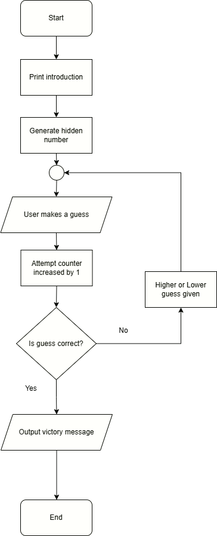

# Guessing Game

Consider the following task to implement a simple guessing game

`The computer picks a number between 1 and 100, and the user tries to guess that number. Whenever the user makes an incorrect guess, they are told whether the number is higher or lower than their guess. When the user correctly guesses the number, a victory message is displayed and the program stops.`

## Flowchart

