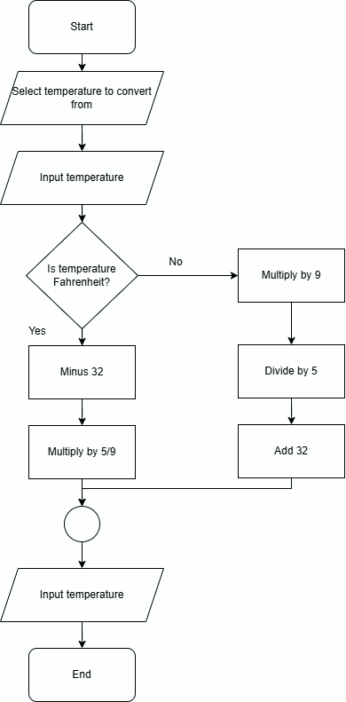

# Temperature Converter

Using the formulas to convert between Celcius and Fahrenheit, create code to take a user input and return the converted temperature. For example, if you have specified you are giving a temperature in Celcius the returned value must be in Fahrenheit.

## Flowchart

